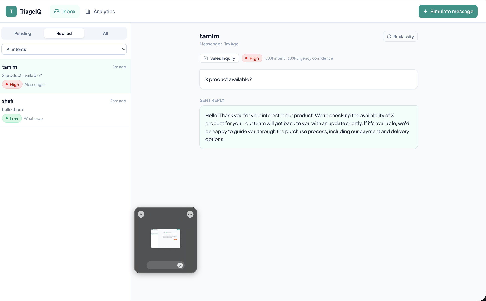
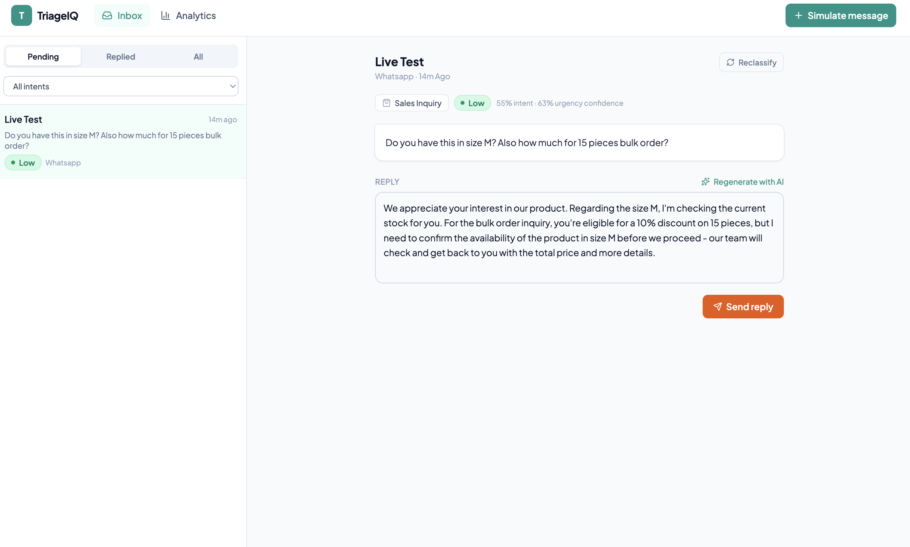
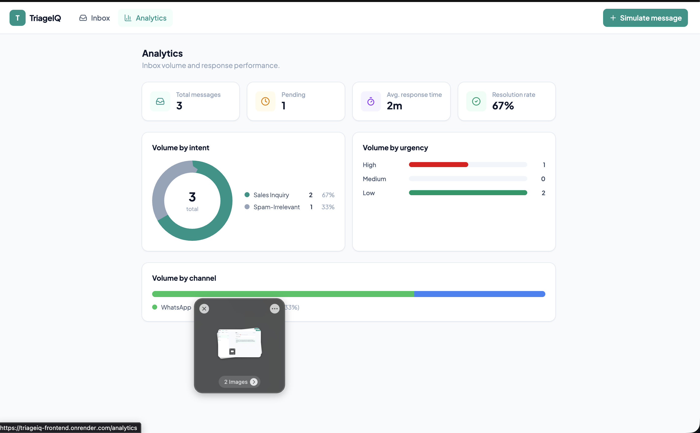

# TriageIQ — AI-Powered Customer Support Inbox Assistant

AI Capstone Project. TriageIQ automatically classifies incoming customer support
messages by **intent** and **urgency**, and drafts an **AI-suggested reply** for each
one, so support agents work a prioritized queue instead of a raw, unsorted inbox.

See [PROPOSAL.md](./PROPOSAL.md) for the full problem statement, solution design, and
AI approach, and [REPORT.md](./REPORT.md) for the final write-up (design decisions,
evaluation results, and conclusions).

## Project Structure

```
AI_Capstone_Project/
├── PROPOSAL.md         Problem statement, solution, AI approach, tech stack
├── REPORT.md           Final report: design decisions, results, conclusions
├── render.yaml          Render Blueprint (backend + frontend + Postgres, all 3)
├── backend/            FastAPI app + AI/ML code
│   ├── app/             API (routes, models, schemas, AI inference)
│   ├── ml/               Dataset generation + classifier training
│   └── tests/
├── frontend/            React (Vite) + Tailwind dashboard
│   └── vercel.json       SPA rewrite rules (only needed for the Vercel alternative)
└── docs/screenshots/     Screenshots referenced from this README
```

## Tech Stack

- **Backend**: Python, FastAPI, SQLAlchemy — SQLite locally, Postgres in production
  (Render free Postgres; the same code runs on both, only `DATABASE_URL` changes)
- **AI/ML**: scikit-learn (intent + urgency classifier), Groq API — Llama 3.3 70B (reply
  suggestion generation, free tier)
- **Frontend**: React (Vite), Tailwind CSS
- **Deployment**: Render — backend (web service), frontend (static site), and database,
  all three from one `render.yaml` Blueprint (Vercel works too for the frontend alone,
  see below, but one platform is simpler to manage)

## AI Model Summary

| Task | Approach | Notes |
|---|---|---|
| Intent classification (Sales / Support / Complaint / Spam) | TF-IDF + Logistic Regression (scikit-learn) | Trained on a synthetic labeled dataset; evaluated with accuracy/precision/recall/F1 on a held-out split — see `backend/ml/metrics.json` after training and REPORT.md for full results. |
| Urgency scoring (Low / Medium / High) | Same classifier pipeline, second label | Same dataset/evaluation as above. |
| Reply suggestion | Groq API, Llama 3.3 70B (prompted with message + detected intent + FAQ context) | Generative — evaluated qualitatively, not accuracy-scored. |

## Setup & Run Instructions

### Backend

```bash
cd backend
python3 -m venv .venv && source .venv/bin/activate
pip install -r requirements.txt
cp .env.example .env   # add your GROQ_API_KEY (free — console.groq.com/keys)
python ml/generate_dataset.py    # generates backend/ml/data/messages.csv
python ml/train_classifier.py    # trains + evaluates, writes model.joblib + metrics.json
uvicorn app.main:app --reload    # http://localhost:8000  (docs at /docs)
```

### Frontend

```bash
cd frontend
npm install
cp .env.example .env   # set VITE_API_URL if backend isn't on localhost:8000
npm run dev             # http://localhost:5180
```

## Deployment

Everything (backend web service, frontend static site, Postgres database) deploys from
the single `render.yaml` Blueprint — one platform, one account. Because the backend and
frontend each need the other's URL, there's a two-pass env var setup:

1. **Push to GitHub** (this repo already syncs there — see the repo's remote).
2. **One Blueprint deploy**: [dashboard.render.com](https://dashboard.render.com) → New
   → Blueprint → select this repo → Render reads `render.yaml` and provisions all three
   resources (`triageiq-backend`, `triageiq-frontend`, `triageiq-db`) together.
3. **First pass — env vars Render can't fill in for you** (each is `sync: false` in the
   Blueprint, meaning you set it manually once):
   - On `triageiq-backend`: `GROQ_API_KEY` — free key from
     [console.groq.com/keys](https://console.groq.com/keys). Leave `ALLOWED_ORIGINS` as
     `http://localhost:5180` for now.
   - On `triageiq-frontend`: `VITE_API_URL` — the `triageiq-backend` service's URL,
     visible on its Render dashboard page (`https://triageiq-backend-xxxx.onrender.com`).
     Setting this triggers a rebuild (it's baked in at build time, not read at runtime).
4. **Close the loop**: once `triageiq-frontend` finishes building, copy *its* URL and
   set it as `ALLOWED_ORIGINS` on `triageiq-backend` (comma-separate if keeping
   localhost too), then let the backend redeploy.

**Alternative**: the frontend can deploy to [Vercel](https://vercel.com/new) instead
(import this repo, set **Root Directory** to `frontend`, same `VITE_API_URL` env var —
`vercel.json` in the frontend folder already has the SPA rewrite rule it needs) if you'd
rather split platforms; the backend steps above are unaffected either way.

- Frontend: [triageiq-frontend.onrender.com](https://triageiq-frontend.onrender.com)
- Backend API: [triageiq-backend-clqq.onrender.com](https://triageiq-backend-clqq.onrender.com) (Swagger docs at `/docs`)

## Usage

1. Open the live frontend (link above). The **Inbox** tab shows the message queue,
   sorted by urgency, filterable by status (Pending/Replied/All) and intent.
2. Click **+ Simulate message** (top right) to add a new customer message — pick a
   channel, write a message, and send it. It's automatically classified by intent and
   urgency and appears in the queue immediately.
3. Click any message to open it. Click **Draft with AI** to generate a suggested reply
   grounded in the business FAQ context; edit the text freely, then **Send reply** to
   mark it resolved (it moves to the Replied tab).
4. Use **Reclassify** on a message to re-run the classifier on demand.
5. The **Analytics** tab summarizes total/pending/replied counts, average response
   time, resolution rate, and volume broken down by intent, urgency, and channel.

## Screenshots

**Inbox** — queue sorted by urgency, message detail panel with intent/urgency badges:


**AI-drafted reply** — generated via Groq, editable before sending:


**Analytics** — KPI cards, intent donut chart, urgency and channel breakdowns:

